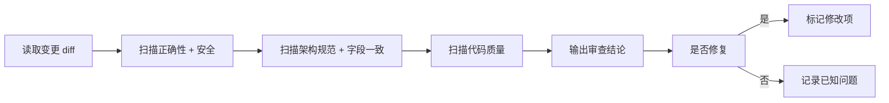

# 审查维度（按优先级降序）

## 1. 正确性（P0）
- 空指针风险：Chain call 是否加 null 判断
- 事务边界：`@Transactional` 是否正确标注在 public 方法、异常是否触发回滚
- 并发安全：循环内调 Mapper（N+1）、共享变量修改
- 分页：offset 计算是否正确 `(pageNo - 1) * pageSize`

## 2. 安全（P0）
- SQL 注入：参数拼接是否使用 `#{}`，有无 `${}` 动态拼接
- 权限校验：管理端 Controller 是否带权限注解，编码是否与菜单表对齐
- 越权：Biz 层是否正确校验归属关系（教师只操作自己课程等）

## 3. 架构规范（P1）
- 层间边界：Controller 不直接调 Mapper、Mapper 不反查 Service
- 包路径：common / admin / web 归属正确（common 不反向依赖端模块）
- 响应：统一走 `R<T>` 包装，不直接返回 PO

## 4. 字段一致性（P1）
- 前端字段名与后端 PO/VO 驼峰一致
- 时间字段统一字符串格式 `yyyy-MM-dd HH:mm:ss`
- 分页结果字段结构统一

## 5. 代码质量（P2）
- 重复代码抽取复用
- 异常不被吞掉（catch 后不空处理）
- 枚举值统一维护，不硬编码 magic number

# 审查流程

# 输出格式

每个发现项包含：
- **严重级别**：P0（必须修）/ P1（建议修）/ P2（值得关注）
- **文件路径** + **行号**
- **问题描述**
- **修改建议**

# 自审清单（提交前过一遍）

- [ ] 新增的 Controller 有权限注解吗？
- [ ] 涉及业务操作的 Service 有 `@Transactional` 吗？
- [ ] Mapper XML 中有 `${}` 拼接吗？（警惕 SQL 注入）
- [ ] 新增实体放在正确的包/模块了吗？
- [ ] 时间字段有 JSON 格式化注解吗？
- [ ] 异常被 catch 后有记录日志或重新抛出吗？
- [ ] 新接口在 API 文档中有记录吗？
- [ ] 循环中调了 Mapper 方法吗？（N+1 风险）
